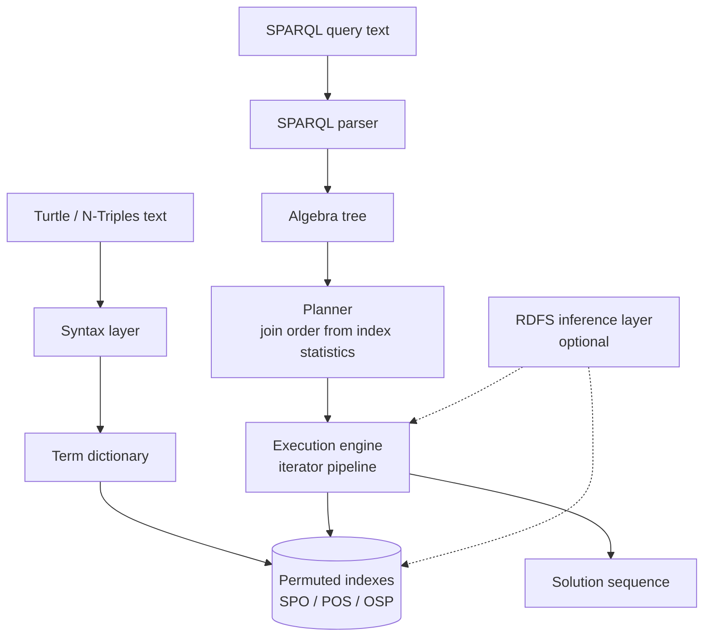

# Trident

An embedded RDF triple store with a SPARQL 1.1 query engine. Course project for **Semantic Web**, MEng in Computer and Software Engineering, Faculty of Computer Systems and Technologies, Technical University of Sofia.

## What it is

Trident is a C++ library that stores RDF data and answers SPARQL queries in the calling process. There is no server, no network protocol and nothing to administer: you link the library, open a store on disk, load Turtle or N-Triples, and run queries.

It exists for the cases where a full RDF server is too much machinery. A desktop application, an analysis tool or a data pipeline that needs to ask a handful of graph queries over a local dataset should not have to provision a database.

## Goals

- Read and write RDF in Turtle and N-Triples, validated against the W3C syntax test suites.
- Store triples with dictionary-encoded terms and three permuted indexes, so that every subject/predicate/object binding pattern is served by a sorted prefix scan.
- Parse SPARQL 1.1 into an algebra tree that matches the operators defined in the specification.
- Choose join order from index statistics rather than from the order the query happens to be written in.
- Execute queries as a pipeline of iterators, so a `LIMIT` can stop the work early.
- Provide RDFS entailment as an optional layer, in both a materialising and a query-time mode, so the tradeoff can be measured instead of assumed.

## Technologies

| Technology | Version or standard | Why |
| --- | --- | --- |
| C++ | C++20 | Embeds into a host process with no separate runtime, and gives direct control over data layout, which is what the index design depends on. |
| CMake | 3.20 or newer | De facto standard for portable C++ builds; consumers can add the library with `add_subdirectory` or `FetchContent`. |
| RDF | RDF 1.1 | The normative data model: IRIs, literals, blank nodes, graphs. |
| Turtle, N-Triples | RDF 1.1 | The two interchange syntaxes in scope. N-Triples is a subset of Turtle, so one parser covers both. |
| SPARQL | SPARQL 1.1 Query | The normative query language. Its algebra is the boundary between parser and execution engine. |
| RDFS | RDF Schema 1.1 | The entailment rules implemented by the optional inference layer. |
| Parsers | Hand-written recursive descent | Both grammars need only limited lookahead. Keeps error messages precise and removes a code generation step from the build. |
| Index storage | Memory-mapped files | The OS handles caching, and reopening an existing store does not rebuild the indexes. |
| GoogleTest | 1.14 or newer | Unit and integration tests. Fetched only when tests are enabled, so embedding does not pull it in. |

## Architecture

Six layers, each depending only on the ones below it. Loading runs down the left path: a parser turns text into terms, the dictionary maps terms to fixed-width ids, and the indexes store the encoded triples in three sort orders. Querying runs down the right path: the SPARQL parser produces an algebra tree, the planner fixes the join order and picks an index per pattern, and the execution engine walks the plan. The engine reaches the data through the indexes and nowhere else.



## Build

```bash
git clone <this repository>
cd trident-semantic-web

cmake -S . -B build -DCMAKE_BUILD_TYPE=Release -DTRIDENT_BUILD_TESTS=ON
cmake --build build -j

ctest --test-dir build --output-on-failure
```

To embed the library without building its tests:

```bash
cmake -S . -B build -DCMAKE_BUILD_TYPE=Release -DTRIDENT_BUILD_TESTS=OFF
cmake --build build -j
```

## Documentation

The project report lives in `docs/` and is written in Bulgarian, because the subject is taught in Bulgarian and the layout is normative for the faculty. It follows the TU-Sofia FKST formatting rules: A4, Times metrics at 12pt, 1.5 line spacing, Roman numerals for sections, tables captioned above and figures below.

```bash
cd docs
latexmk -pdf Main.tex
```

The output is `docs/build/Main.pdf`. Unfilled facts are marked in the source and can be listed with:

```bash
grep -rn 'TODO' docs/chapters docs/Main.tex docs/references.bib
```

## Status

Scaffold only. Nothing is implemented yet.

- [x] Repository layout and build documentation
- [x] Report skeleton with chapter structure and title page
- [x] Bibliography of primary specifications and reference papers
- [ ] CMake build files
- [ ] Term dictionary
- [ ] Turtle and N-Triples parser
- [ ] Turtle and N-Triples serialiser
- [ ] Permuted index storage and memory mapping
- [ ] SPARQL parser and algebra tree
- [ ] Query planner
- [ ] Execution engine
- [ ] RDFS inference layer
- [ ] W3C test suite harness
- [ ] Performance measurements against reference implementations
- [ ] Results and conclusion chapters filled in

## License

MIT. See [LICENSE](LICENSE).
