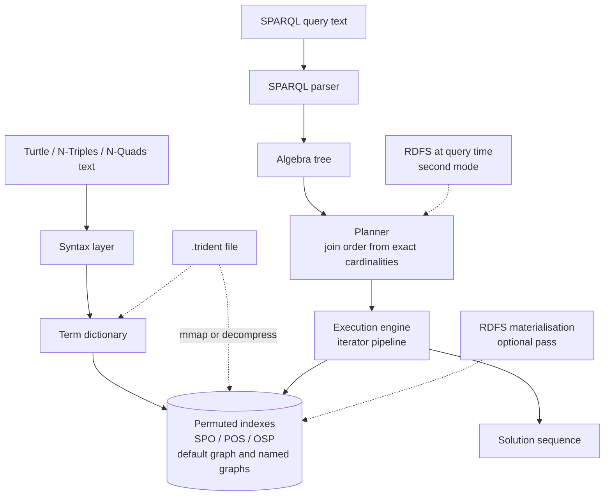

# Trident

An embedded RDF triple store with a SPARQL 1.1 query engine. Course project for **Semantic Web**, MEng in Computer and Software Engineering, Faculty of Computer Systems and Technologies, Technical University of Sofia.

## What it is

Trident is a C++ library that stores RDF data and answers SPARQL queries in the calling process. There is no server, no network protocol and nothing to administer: you link the library, load Turtle or N-Triples, and run queries.

It exists for the cases where a full RDF server is too much machinery. A desktop application, an analysis tool or a data pipeline that needs to ask a handful of graph queries over a local dataset should not have to provision a database.

**No dependencies.** A C++20 compiler and CMake are all that is needed. Nothing is fetched at configure time, there is no package manager step, and the test runner and the timing harness are part of the repository.

## What it does

- Reads Turtle and N-Triples: prefixes and base, literals with language tags and datatypes, blank nodes and `[]`, collections, the `a` keyword, predicate and object lists. N-Triples is the same parser with a strict flag that rejects everything Turtle adds. Writes N-Triples.
- Interns every IRI, blank node and literal to a 64-bit id, with a reverse dictionary for output.
- Keeps three permuted indexes over the encoded triples, SPO, POS and OSP, each sorted and searchable by prefix, so every one of the eight binding combinations is served by a prefix of one of them.
- Parses a subset of SPARQL 1.1 into an algebra tree: `SELECT` with projection and `DISTINCT`, basic graph patterns, `FILTER` with comparison, logical and arithmetic operators and 25 built-in functions, `OPTIONAL`, `UNION`, `ORDER BY`, `LIMIT`, `OFFSET`, and `COUNT`, `SUM`, `MIN`, `MAX`, `AVG` and `SAMPLE` with `GROUP BY`. Everything outside the subset is rejected with a line and a column, never ignored.
- Plans the join order from the exact cardinality of each pattern, which a prefix search on the index gives in `O(log n)`, and prints the plan it chose. A flag forces the naive left-to-right order so the value of planning can be measured.
- Executes as a pipeline of iterators: index scan, index nested loop join, merge join, left join, union, filter, projection, distinct, sort, group with aggregation, and slice. Only sorting and grouping materialise, because only they have to.
- Materialises RDFS entailment: `subClassOf` and `subPropertyOf` including transitivity, `domain` and `range`, applied to a fixed point. The same rules can be applied at query time instead, without writing the inferred triples into the store.
- Saves the dictionary and the three indexes to a `.trident` file and reopens it without rebuilding. Plain files are memory-mapped; compressed files use delta + variable-byte encoding of each sorted permutation.
- Stores named graphs as quads. Turtle and N-Triples load into the default graph; N-Quads can name a graph. `GRAPH` in SPARQL selects one named graph or binds a variable to each of them.

## Architecture

Layers, each depending only on the ones below it. Loading runs down the left path: a parser turns text into terms, the dictionary maps terms to fixed-width ids, and the indexes store the encoded triples in three sort orders. Querying runs down the right path: the SPARQL parser produces an algebra tree, the planner fixes the join order and picks an index per pattern, and the execution engine walks the plan. The engine reaches the data through the indexes and nowhere else.



## Build

```bash
cmake -S . -B build -G Ninja -DCMAKE_BUILD_TYPE=Release
cmake --build build
```

Ninja is not required; drop `-G Ninja` to use the default generator. To embed the library without its tests or tools:

```bash
cmake -S . -B build -DCMAKE_BUILD_TYPE=Release -DTRIDENT_BUILD_TESTS=OFF -DTRIDENT_BUILD_TOOLS=OFF
cmake --build build
```

## Run

The demo needs no arguments and downloads nothing. It generates the dataset, loads it, and runs ten queries of increasing complexity, printing the parsed algebra, the chosen plan, the solution count and the elapsed time for each, then compares the planned join order against the naive one and finishes with the RDFS pass.

```bash
build/trident_demo
```

`cmake --build build --target demo` builds and runs it in one step.

The tests are registered with CTest as thirteen entries, one per group, covering 139 individual cases:

```bash
ctest --test-dir build --output-on-failure
```

The benchmark measures load throughput, index build time, structure size, query latency with the planner on against off, merge join against index nested loop join, and the cost of RDFS materialisation. It prints the solution count next to every timing, because a configuration that returns fewer solutions is faster for a reason that is not speed.

```bash
build/trident_bench --repeats 15
```

There is also a command line front end:

```bash
build/trident_cli data/small.ttl --plan -q "PREFIX ex: <http://example.org/>
SELECT ?n WHERE { ?p a ex:Author . ?p ex:name ?n }"

build/trident_cli --generate 5000 --rdfs -q "SELECT (COUNT(*) AS ?n) WHERE { ?s ?p ?o }"

build/trident_cli data/small.ttl --save /tmp/small.trident --plain
build/trident_cli --open /tmp/small.trident --rdfs-query -q "SELECT ?x WHERE { ?x a <http://example.org/Person> }"
```

Run `build/trident_cli --help` for the full option list.

## Layout

| Path | Contents |
| --- | --- |
| `include/trident/` | public headers, one per layer |
| `src/` | implementation |
| `tools/` | `trident_demo`, `trident_bench`, `trident_cli` |
| `tests/` | the assert-based runner and thirteen test groups |
| `data/` | `small.ttl` and `small.nt`, the hand-checked graphs the tests assert against |
| `docs/` | the project report and the raw benchmark output |

## Documentation

The project report lives in `docs/` and is written in Bulgarian, because the subject is taught in Bulgarian and the layout is normative for the faculty. It follows the TU-Sofia FKST formatting rules: A4, Times metrics at 12pt, 1.5 line spacing, Roman numerals for sections, tables captioned above and figures below.

```bash
cd docs
latexmk -pdf Main.tex
```

The output is `docs/build/Main.pdf`. The raw output of the benchmark runs quoted in the report is kept in `docs/measurements/`. Unfilled facts are marked in the source and can be listed with:

```bash
grep -rn 'TODO' docs/chapters docs/Main.tex docs/references.bib
```

## Status

- [x] CMake build with no external dependencies
- [x] Term dictionary with 64-bit encoded identifiers
- [x] Turtle and N-Triples parser
- [x] N-Triples serialiser
- [x] Three permuted indexes with prefix search and exact cardinalities
- [x] SPARQL parser and algebra tree
- [x] Query planner with a switch for the naive order
- [x] Execution engine: index scan, index nested loop join, merge join, left join, union, filter, distinct, sort, group with aggregation, slice
- [x] RDFS materialisation
- [x] Locally written syntax corpus, 103 cases, plus hand-checked query answers
- [x] Benchmark and measured results in the report
- [x] Memory-mapped index files, so a store can be reopened without rebuilding
- [x] Index compression
- [x] RDFS entailment at query time, as the second mode
- [x] Named graphs and quads
- [ ] Comparison against Apache Jena and RDFLib

Apache Jena and RDFLib are not present in this environment, so that comparison was not run and no numbers were invented for it.

## License

MIT. See [LICENSE](LICENSE).
